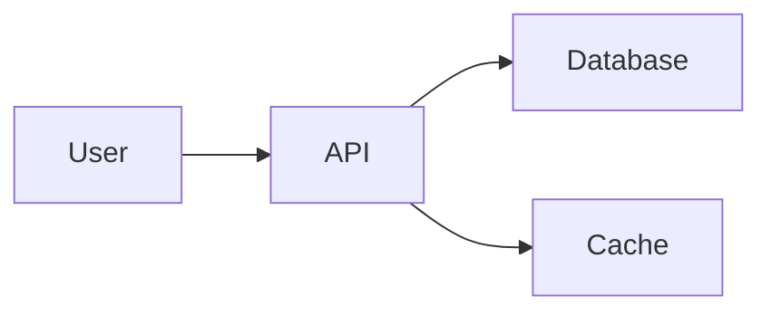

# ASCII Architecture Diagram Generator

Convert Mermaid diagrams or architecture descriptions to ASCII art format.

---

## Usage

```
/ascii-diagram <description or mermaid code>
```

---

## Supported Diagram Types

### 1. Flowcharts (Top-Down / Left-Right)
```
┌─────────┐      ┌─────────┐      ┌─────────┐
│  Input  │ ───▶ │ Process │ ───▶ │ Output  │
└─────────┘      └─────────┘      └─────────┘
```

### 2. Sequence Diagrams
```
┌────────┐          ┌────────┐          ┌────────┐
│ Client │          │ Server │          │   DB   │
└───┬────┘          └───┬────┘          └───┬────┘
    │    request        │                   │
    │──────────────────▶│                   │
    │                   │      query        │
    │                   │──────────────────▶│
    │                   │      result       │
    │                   │◀──────────────────│
    │    response       │                   │
    │◀──────────────────│                   │
```

### 3. Tree Structures
```
                    ┌─────────┐
                    │  Root   │
                    └────┬────┘
           ┌─────────────┼─────────────┐
           ▼             ▼             ▼
      ┌─────────┐   ┌─────────┐   ┌─────────┐
      │ Child 1 │   │ Child 2 │   │ Child 3 │
      └─────────┘   └─────────┘   └─────────┘
```

### 4. Pipeline/Data Flow
```
┌──────────┐    ┌──────────┐    ┌──────────┐    ┌──────────┐
│  Input   │───▶│  Step 1  │───▶│  Step 2  │───▶│  Output  │
└──────────┘    └──────────┘    └──────────┘    └──────────┘
                     │
                     ▼
               ┌──────────┐
               │ Side Eff │
               └──────────┘
```

### 5. State Diagrams
```
                    ┌───────────────┐
                    ▼               │
┌─────────┐    ┌─────────┐    ┌─────────┐
│  Idle   │───▶│ Running │───▶│  Done   │
└─────────┘    └─────────┘    └─────────┘
     ▲              │
     └──────────────┘
         (reset)
```

---

## ASCII Building Blocks

### Boxes
```
┌─────────┐   ╔═════════╗   +----------+
│  Normal │   ║  Double ║   |  Simple  |
└─────────┘   ╚═════════╝   +----------+
```

### Arrows
```
───▶  (right)      ◀───  (left)
  │                  ▲
  ▼  (down)          │   (up)

───▷  (hollow)     ◁───  (hollow)
─ ─▶  (dashed)     ◀─ ─  (dashed)
════▶ (double)     ◀════ (double)
```

### Connectors
```
┌───┬───┐    ┌───┼───┐
│   │   │    │   │   │
├───┼───┤    └───┴───┘
│   │   │
└───┴───┘
```

### Decision Diamond
```
       ▲
      ╱ ╲
     ╱   ╲
    ╱ Yes?╲
    ╲     ╱
     ╲   ╱
      ╲ ╱
       ▼
```

---

## Conversion Rules

When converting from Mermaid to ASCII:

1. **graph TD/TB** → Top-to-bottom layout
2. **graph LR** → Left-to-right layout
3. **A --> B** → `A ───▶ B`
4. **A -.-> B** → `A ─ ─▶ B` (dashed)
5. **A ==> B** → `A ════▶ B` (thick)
6. **A --> |text| B** → Arrow with label above/below
7. **subgraph** → Grouped box with title

---

## Arguments

`$ARGUMENTS` - The Mermaid code or architecture description to convert

---

## Execution Steps

1. Parse the input (Mermaid syntax or natural language description)
2. Identify diagram type (flowchart, sequence, tree, etc.)
3. Calculate box sizes based on content
4. Determine layout and spacing
5. Render ASCII art with proper alignment
6. Output the diagram in a code block

---

## Examples

### Input (Mermaid):


### Output (ASCII):
```
┌────────┐      ┌────────┐      ┌──────────┐
│  User  │ ───▶ │  API   │ ───▶ │ Database │
└────────┘      └───┬────┘      └──────────┘
                    │
                    │           ┌──────────┐
                    └─────────▶ │  Cache   │
                                └──────────┘
```

### Input (Natural Language):
"3 aşamalı pipeline: Input -> Processing -> Output"

### Output (ASCII):
```
┌─────────┐      ┌────────────┐      ┌─────────┐
│  Input  │ ───▶ │ Processing │ ───▶ │ Output  │
└─────────┘      └────────────┘      └─────────┘
```
