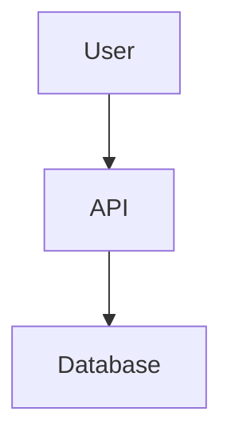
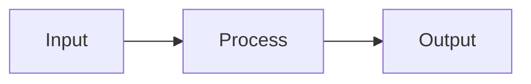

# Render Mermaid Diagrams Command

Render all Mermaid code blocks in a markdown file to SVG images and save them to the `diagrams/` folder.

## Execution Steps

1. **Determine target file**:
   - If a file path argument is provided, use it
   - If no argument, check if user has a markdown file open in their IDE
   - If still unclear, ask user which file to process

2. **Read the markdown file** using the Read tool

3. **Create diagrams directory**:
   - Create a `diagrams/` directory in the project root if it doesn't exist
   - Use Bash: `mkdir -p diagrams`

4. **Find all Mermaid code blocks**:
   - Look for code blocks with the `mermaid` language identifier
   - Pattern: ` ```mermaid ` followed by diagram content and ` ``` `
   - Track the line number and content of each block

5. **For each Mermaid block found**:

   a. **Extract section context**:
      - Find the nearest heading above the code block (##, ###, etc.)
      - Use this for naming the output file
      - If no heading found, use "diagram-N" where N is the sequence number

   b. **Generate a meaningful filename**:
      - Use the pattern: `{source-basename}-{section-slug}.svg`
      - Keep it descriptive and readable

   c. **Preview the diagram**:
      - Use `mcp__plugin_claude-mermaid_mermaid__mermaid_preview` tool
      - Parameters:
        - `diagram`: The Mermaid code content
        - `preview_id`: A unique ID based on filename (e.g., "architecture-overview")
        - `format`: "svg"
        - `theme`: "default"
        - `width`: 800
        - `height`: 600

   d. **Save the diagram**:
      - Use `mcp__plugin_claude-mermaid_mermaid__mermaid_save` tool
      - Parameters:
        - `preview_id`: Same ID used in preview
        - `save_path`: `./diagrams/{filename}.svg`
        - `format`: "svg"

   e. **Update markdown with image link**:
      - Check if an image link already exists after the code block
      - If it exists, update the path
      - If not, insert a new link after the closing ` ``` `

6. **Update the markdown file**:
   - For each rendered diagram, insert or update the image link
   - Place the image link on the line immediately after the closing ` ``` `
   - Format: ``
   - Add a blank line before the image link for readability

7. **Write the updated file** using the Write tool

8. **Report results**:
   - List how many diagrams were rendered
   - Show the paths to generated images in `diagrams/` folder

## Image Naming Convention

Generate filenames using this pattern:
```
{source-basename}-{section-slug}.svg
```

Where:
- `source-basename`: The markdown filename without extension (e.g., "architecture")
- `section-slug`: Kebab-case version of the nearest heading (e.g., "system-overview")

Examples:
- `architecture-system-overview.svg`
- `api-docs-authentication-flow.svg`
- `readme-data-flow.svg`

## Example Usage

**Input file** (`docs/architecture.md`):
````markdown
# Architecture

## System Overview



## Data Flow


````

**After running** `/render-diagrams docs/architecture.md`:

1. Files created in `diagrams/`:
   - `diagrams/architecture-system-overview.svg`
   - `diagrams/architecture-data-flow.svg`

2. Updated markdown:
````markdown
# Architecture

## System Overview


## Data Flow


````

## Workflow Notes

- **mermaid_preview** renders the diagram and opens a live preview in the browser
- **mermaid_save** copies the rendered output to the specified path
- Always call `mermaid_preview` before `mermaid_save` - save requires an active preview
- Use the same `preview_id` for both preview and save operations
- SVG format is used for GitHub README compatibility

## Error Handling

- If the claude-mermaid MCP is not connected, inform the user to check their MCP configuration
- If a Mermaid diagram has syntax errors, report the error but continue with other diagrams
- If the file doesn't exist, inform the user and suggest checking the path
- If no Mermaid blocks are found, inform the user (this is not an error)

## Tips

- All diagrams are saved to the project's `diagrams/` folder for easy organization
- SVG format ensures GitHub renders images directly in README files
- The preview opens in browser with live reload - useful for checking before save
- Run this command after finishing documentation to render all diagrams at once
